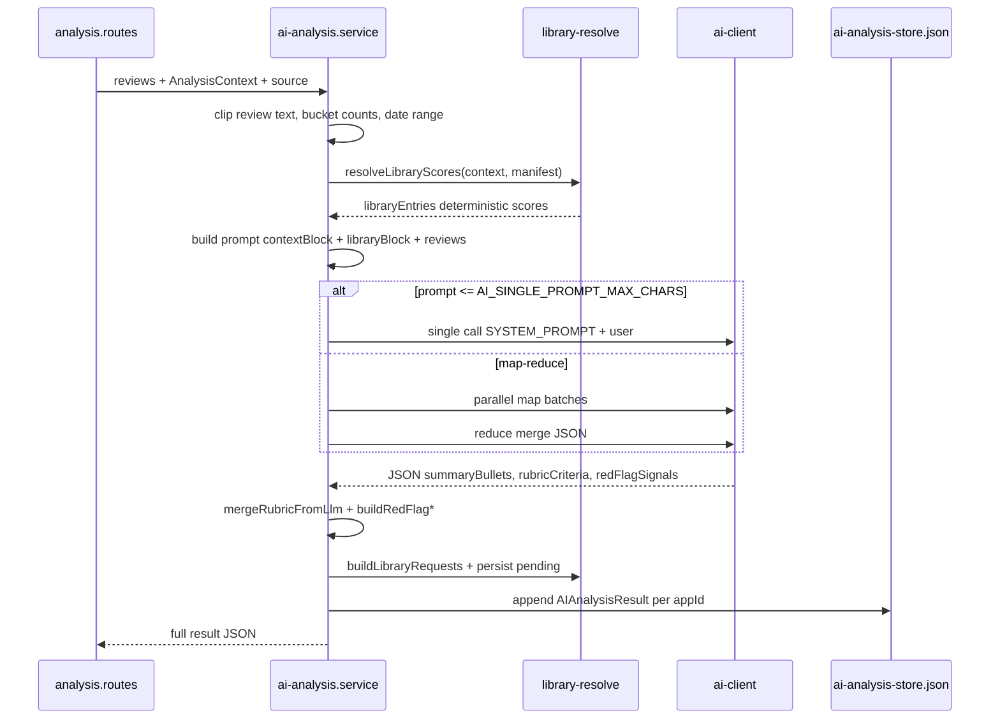

# System context: Luồng AI Review — Sourcing monorepo

Bạn đang làm việc trên dự án **Sourcing** (game sourcing / đánh giá game mobile cho thị trường VN). Phần **AI Review** phân tích bình luận người chơi và chấm điểm theo rubric. Đọc kỹ luồng dưới đây trước khi sửa BE/FE.

## 1. Cấu trúc repo

| Thư mục | Vai trò |
|---------|---------|
| `be/` | API Express, Prisma (CSDL game/review), LLM, rubric, thư viện JSON |
| `fe/` | React + Vite — UI AI Review, Game Detail, Libraries |
| `taptap-proxy/` | Proxy Railway gọi TapTap (tránh 403 từ IP datacenter) |

**Quy ước:** BE chỉ trả JSON; hiển thị (badge CSDL/TapTap/Steam/CSV, modal, rubric, red flag) làm ở `fe/src/`.

## 2. Bốn đường vào phân tích

Tất cả đều gọi chung `AiAnalysisService.runLLMAnalysis()` sau khi có danh sách review + `AnalysisContext`.

| Nguồn | `source` trong kết quả | Route BE | FE |
|-------|------------------------|----------|-----|
| Review trong PostgreSQL (game đã crawl) | `database` | `POST /api/analysis/analyze/:appId` | Game Detail → AI Review |
| TapTap hoặc Steam (URL / appId) | `external` hoặc `steam` | `POST /api/analysis/analyze-external` | `fe/src/pages/AIAnalysis.tsx` |
| Upload CSV | `csv-upload` | `POST /api/analysis/analyze-csv` | AIAnalysis (upload) |

**Review window** (lọc theo thời gian): body `{ reviewWindow }` — `all` | `days: 7|14|30|60` | `range: { from, to }`. Xử lý: `be/src/utils/review-window.ts` — SQL bounds cho CSDL; filter in-memory cho external/CSV.

### Thu thập dữ liệu theo nguồn

- **CSDL:** `fetchStratifiedReviews(appId)` — stratified theo sao 1–5, batch SQL (`be/src/services/ai-analysis.service.ts`).
- **TapTap external:** `be/src/routes/analysis.routes.ts` → `fetchTapTapBundle` — ưu tiên `TAPTAP_PROXY_URL`, fallback direct; reviews + `detailRaw` cho metadata.
- **Steam:** `fetchSteamReviewsUpTo` + `buildSteamDetailRaw`.
- **CSV:** `parseCsvBuffer` → reviews + hash `appId` giả.

`AnalysisContext` (`be/src/services/analysis-context.ts`): `tagValues`, `developerName`, `publisherName`, `installSizeMb`, `daysSinceUpdate`, `fansCount`, `searchHaystack` — trích từ TapTap raw (hoặc tối thiểu với CSV).

## 3. Pipeline xử lý chính (`runLLMAnalysis`)

### 3.1 Trước LLM

1. Load `be/data/rubric/manifest.json` → `getActiveCriteria` (gói thể loại: `inferGenrePack` từ tags).
2. **`resolveLibraryScores`**: khớp deterministic từ `data/libraries/*.json` (studio, genre tags, game size, update cycle, community, IP, system spec, art…) → điểm + `matchedKey` đưa vào prompt.
3. Prompt user gồm: tên game, **contextBlock**, **libraryBlock**, block review dạng `[#idx|sao|ngày] nội dung`, **finalSpec** (JSON schema tiếng Việt).

### 3.2 LLM

- Client: `be/src/utils/ai-client.ts` (`callLLM`, model từ env).
- Output bắt buộc: `summaryBullets`, `recentTrendBullets`, `rubricCriteria[]` (mỗi criterion: `id`, `score`, `reasoning`, `strengths[]`, `weaknesses[]`), `redFlagSignals` (severity / boolean).
- **Không** dùng `strengths`/`weaknesses`/`sentimentScore` cấp global (legacy đã bỏ).
- Nếu prompt quá dài → **map-reduce**: map song song (`AI_MAP_CONCURRENCY`), gộp tối đa `AI_MAX_MAP_CHUNKS`, reduce một lần.

Env tuning: `AI_REVIEW_MAX_CHARS`, `AI_SINGLE_PROMPT_MAX_CHARS`, `AI_MAP_CHUNK_MAX_CHARS`, …

### 3.3 Sau LLM

1. **`mergeRubricFromLlm`** (`be/src/services/rubric-merge.ts`):
   - Với từng criterion active: ưu tiên **library** cho id trong `LIBRARY_OVERRIDE_IDS` (developer, genre, game_size, …); còn lại lấy **LLM**; có thể **merged** (library score + LLM reasoning).
   - Red flag: `score` null, `flagPresent` / `severity` từ `redFlagSignals`.
   - Tính `aggregate.weightedScore`, `partRollups`, quyết định thử nghiệm (`must_test` … `blocked_red_flag`), hard gate red flag.
   - Trọng số phần phụ thuộc gói `base` vs genre pack (Gameplay ~14%, Genre-specific ~24%, …).

2. **`buildLibraryRequests(context, libraryEntries, rubric)`** — **sau** merge rubric:
   - Nếu metadata không khớp lib (studio chưa có, game_size không map rule, …) → tạo đề xuất pending.
   - `jsonSuggestion.score` lấy từ điểm criterion AI tương ứng (`overview.developer`, `overview.game_size`, `liveops.content_update_cycle`, `socialization.community_size`).
   - Ghi bảng `LibraryPending` (app DB) qua `persistLibraryRequests` (dedupe type+label).

3. **`buildRedFlagAtAGlance` / `buildRedFlagsChecklist`** cho UI cảnh báo nội dung VN.

4. **`sentimentScore`** = `rubric.aggregate.weightedScore` (điểm tổng hiển thị).

5. Lưu vào **`.ai-analysis-store.json`** (key `appId` → mảng lịch sử, mỗi lần `analyzedAt` mới). Không phải bảng Prisma.

## 4. API đọc / xóa kết quả

- `GET /api/analysis/all` — toàn bộ analyses (FE grid).
- `GET /api/analysis/:appId` — latest; `GET .../history` — danh sách.
- `DELETE` theo `analyzedAt` hoặc xóa hết theo appId.

## 5. Frontend hiển thị

| Màn | File chính | Hành vi |
|-----|------------|---------|
| AI Review | `fe/src/pages/AIAnalysis.tsx` | Chọn nguồn + ReviewWindowPicker → analyze → grid thẻ (badge nguồn, `analyzedAt`, điểm) → modal |
| Game Detail | `fe/src/pages/GameDetail.tsx` | Analyze CSDL + lịch sử + overview |
| Chi tiết | `fe/src/components/AnalysisDetailModal.tsx` + `AnalysisDetailContent.tsx` | Thứ tự: header → **RedFlagSection** (nếu có) → summary/trend → sentiment → **RubricPanel** |
| Rubric đóng | `fe/src/components/RubricPanel.tsx` | Chỉ bullet `elementVi: reasoning` (không list strengths/weaknesses khi đóng) |
| Lib pending | `fe/src/pages/Libraries.tsx` + `PendingMergeTable` | Merge vào `*.json`, pre-fill score từ `jsonSuggestion` |

Localization EN: query `localizeAnalysisToEn` (nền, không hiện “Đang dịch…” trong modal).

## 6. Rubric & thư viện — file quan trọng

- Rubric: `be/data/rubric/manifest.json`
- Libraries: `be/data/libraries/studio-tiers.json`, `genre-tiers.json`, `game-size-tiers.json`, `update-cycle-tiers.json`, `community-size-tiers.json`, `ip-theme-tiers.json`, `system-requirement-tiers.json`, `art-style-keywords.json`, `pending-additions.json`
- Logic: `be/src/services/library-resolve.ts`, merge apply `be/src/services/pending-merge-apply.ts`

## 7. Khi sửa code — lưu ý

- Đừng ghi `persistLibraryRequests` **trước** `mergeRubricFromLlm` (mất điểm AI trên pending).
- Đừng đưa logic hiển thị Có/Không/red flag vào BE — FE dùng `red-flag-utils`, `RedFlagSection`.
- TapTap: test cả proxy và fallback; parse JSON proxy dùng `be/src/utils/proxy-json.ts`.
- Một `appId` có **nhiều** bản phân tích; luôn identify bằng `(appId, analyzedAt)`.

## 8. File index nhanh

**BE:** `src/routes/analysis.routes.ts`, `src/services/ai-analysis.service.ts`, `src/services/analysis-context.ts`, `src/services/rubric-merge.ts`, `src/services/library-resolve.ts`, `src/services/rubric-manifest.ts`, `src/utils/review-window.ts`, `src/utils/ai-client.ts`, `src/utils/taptap-proxy-fetch.ts`

**FE:** `src/pages/AIAnalysis.tsx`, `src/pages/GameDetail.tsx`, `src/components/AnalysisDetailContent.tsx`, `src/components/RubricPanel.tsx`, `src/components/RedFlagSection.tsx`, `src/services/api.ts`, `src/types/index.ts`

---

*Phiên bản mô tả: theo codebase Sourcing sau refactor AI Review (review window, rubric-first score, modal UX, library score từ rubric).*
